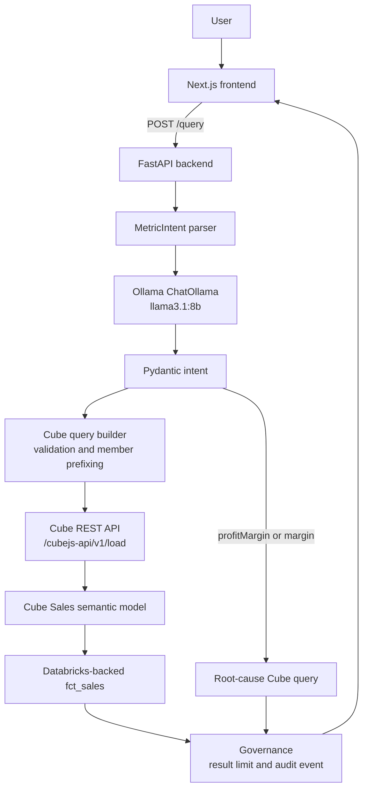
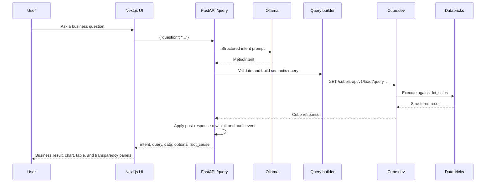

# MetricMind

MetricMind is a conversational Business Intelligence system that turns natural-language business questions into governed analytical queries. It combines a FastAPI backend, an Ollama-hosted structured intent parser, Cube.dev's semantic layer, a Databricks-backed model, and a Next.js analysis workspace.

The current implementation is an actively developed local analytics application. It is not presented as a production deployment: authentication, multi-user persistence, operational monitoring, and a complete automated test suite are not currently implemented.

## Overview

MetricMind is designed around a simple contract:

1. A user asks a business question in natural language.
2. The backend asks Ollama to map the question to a structured `MetricIntent`.
3. The intent is validated against an allowlisted metric and dimension vocabulary.
4. The validated intent is converted into a Cube query.
5. Cube executes the query against the configured Databricks-backed semantic model.
6. Governance controls audit the execution and limit the returned result size.
7. The frontend renders the returned data, visualization, intent, semantic query, and available diagnostic information.

The semantic layer is the source of truth for business metric definitions. The language model selects governed members; it does not write arbitrary SQL for the user.

## Problem Statement

Business users often know what they want to understand but not how to express it as SQL against a warehouse schema. Direct text-to-SQL also makes it easy for metrics to be defined inconsistently, for filters to be missed, or for users to lose visibility into how an answer was produced.

MetricMind addresses that workflow by separating language understanding from analytical execution. Natural language is converted into a constrained intent, and the intent is executed through a semantic layer with visible query and governance information.

## Solution

The application separates responsibilities across four layers:

- **Frontend:** captures questions and presents structured results.
- **Agent backend:** parses questions into `MetricIntent` and validates the requested members.
- **Semantic layer:** defines measures, dimensions, and formulas in Cube.dev.
- **Data platform:** provides the `fct_sales` analytical data model backed by Databricks.

## Key Features

- Natural-language question input through a Next.js interface.
- Structured intent parsing with LangChain and Ollama `llama3.1:8b`.
- Pydantic models for measures, dimensions, and filters.
- Allowlist validation before a Cube query is executed.
- Temporal intent rules for quarters, months, years, date ranges, and explicit time-series breakdowns.
- Cube semantic queries against the `Sales` model.
- Configurable query timeout, retry wait, retry count, and maximum result rows.
- Lightweight semantic-query audit logging.
- Optional margin root-cause analysis when the parsed measure is `profitMargin` or `margin`.
- ECharts visualizations, KPI cards, results tables, intent panels, root-cause output, and semantic-query transparency in the frontend.
- Local browser query history with a maximum of 10 entries.
- Governance and SQL-availability transparency controls.

## System Architecture



The primary `/query` flow executes the main Cube query first. When the parsed intent includes `profitMargin` or `margin`, the service then executes the current root-cause query as a separate Cube request. The root-cause route currently calls the analysis tool without passing the user's question-derived scope.

## Data Flow



## Technology Stack

### Backend

- Python
- FastAPI `0.141.1`
- Uvicorn `0.52.4`
- Pydantic `2.12.5`
- LangChain `1.3.18` and `langchain-ollama` `1.1.0`
- Ollama Python client `0.6.2`
- `ChatOllama` with model `llama3.1:8b` and temperature `0`
- Requests for Cube REST calls

### Frontend

- Next.js `16.3.4`
- React `19.2.8`
- TypeScript
- Tailwind CSS `4` through `@tailwindcss/postcss`
- ECharts `6.1.0`
- `echarts-for-react` `3.0.6`

### Data and semantic layer

- Cube.dev server and Databricks JDBC driver
- Databricks SQL Warehouse/data source
- dbt Core with the Databricks adapter for the tracked transformation project
- DataCo Smart Supply Chain source dataset, as described in `docs/build_log.md`

## Project Structure

```text
metric-mind/
├── agent_backend/
│   ├── app/
│   │   ├── agent/
│   │   │   ├── intent_parser.py
│   │   │   ├── llm_config.py
│   │   │   ├── orchestrator.py
│   │   │   ├── prompts.py
│   │   │   └── tools/root_cause_tool.py
│   │   ├── api/routes.py
│   │   ├── cube/
│   │   │   ├── client.py
│   │   │   ├── query_builder.py
│   │   │   └── service.py
│   │   ├── governance/policy.py
│   │   ├── models/schemas.py
│   │   └── main.py
│   └── requirements.txt
├── cube/
│   ├── Dockerfile
│   └── .env                         # local, ignored configuration
├── data/raw/                        # local source data, ignored
├── dbt_project/
│   ├── models/staging/
│   ├── models/intermediate/int_sales.sql
│   ├── models/marts/fct_sales.sql
│   └── dbt_project.yml
├── docs/build_log.md
├── docker-compose.yml               # declares the Cube service
├── frontend/
│   ├── app/page.tsx
│   ├── app/layout.tsx
│   ├── components/                  # active workspace components
│   ├── lib/api.ts
│   ├── lib/format.ts
│   ├── types/query.ts
│   ├── package.json
│   └── package-lock.json
├── notebooks/
├── semantic_layer/
│   ├── model/Sales.js
│   ├── cube.js
│   ├── package.json
│   └── .env                         # local, ignored configuration
├── .env.example
└── README.md
```

The frontend also contains additional component directories under `frontend/components/analysis`, `layout`, `query`, `states`, and `technical`. The current `frontend/app/page.tsx` imports the top-level active components and the shared `lib`/`types` modules listed above.

## Semantic Layer

The checked-in Cube model is `semantic_layer/model/Sales.js`. It queries the `workspace.default.fct_sales` table.

### Cube `Sales` measures

The model currently defines:

- `count`
- `totalSales`
- `totalQuantity`
- `averageSales`
- `totalRevenue`
- `totalProfit`
- `totalCost`
- `profitMargin`
- `shippingCost`
- `materialCost`

The current definitions include these important behaviors:

- `totalSales` and `totalRevenue` both aggregate the `sales` column.
- `totalProfit` aggregates `order_profit_per_order`.
- `totalCost` is defined as `sales - order_profit_per_order`.
- `profitMargin` is calculated as total profit divided by total sales, expressed as a percentage.
- `shippingCost` and `materialCost` currently use the same sales-minus-profit expression in the Cube model. They are separate member names but are not currently distinct cost formulas.

### Cube `Sales` dimensions

The model defines:

- `orderId`
- `market`
- `orderCity`
- `orderState`
- `orderDate`
- `shippingDate`
- `region`
- `country`
- `state`
- `category`
- `department`
- `orderStatus`
- `deliveryStatus`

`orderDate` and `shippingDate` are Cube time dimensions.

### Agent-facing allowlist

The backend query builder currently accepts these measures: `totalSales`, `totalQuantity`, `averageSales`, `totalRevenue`, `totalProfit`, `shippingCost`, `materialCost`, `totalCost`, and `profitMargin`.

It accepts these dimensions: `market`, `region`, `country`, `state`, `category`, `department`, `orderStatus`, `deliveryStatus`, and `orderDate`.

This allowlist is narrower than the complete Cube model. For example, `count`, `orderId`, `orderCity`, and `shippingDate` are present in the Cube model but are not currently accepted by the query builder. The prompt's advertised measure list also does not list `shippingCost` or `materialCost`, although the builder and Cube model do.

## Agent and Intent Parsing

`agent_backend/app/agent/intent_parser.py` creates a structured-output LangChain wrapper around the configured `ChatOllama` instance:

```python
class MetricIntent(BaseModel):
    measures: list[str] = Field(default_factory=list)
    dimensions: list[str] = Field(default_factory=list)
    filters: list[MetricFilter] = Field(default_factory=list)
```

Each filter has:

```python
class MetricFilter(BaseModel):
    member: str
    operator: str
    values: list[str]
```

The prompt in `agent_backend/app/agent/prompts.py` instructs the model to:

- select only members from the defined semantic vocabulary;
- never invent measures or dimensions;
- include at least one measure for quantitative questions;
- keep business formulas in the semantic layer rather than asking the model to calculate them;
- represent requested periods such as quarters, months, years, and ranges as `orderDate` filters;
- use `orderDate` as a dimension only for explicit date breakdowns, trends, or grouping requests;
- preserve explicitly requested analytical dimensions such as region, market, category, country, state, and department.

The parser returns the Pydantic model produced by Ollama. It does not independently calculate business metrics.

## Query Validation and Construction

`agent_backend/app/cube/query_builder.py` validates the parsed intent before execution:

- invalid measures raise `ValueError("Invalid measures: [...]")`;
- invalid dimensions raise `ValueError("Invalid dimensions: [...]")`;
- an empty measure list raises `ValueError("At least one measure is required")`.

Valid members are prefixed with `Sales.` for Cube. Filters are serialized into Cube-compatible dictionaries, for example:

```json
{
  "measures": ["Sales.totalRevenue"],
  "dimensions": ["Sales.region"],
  "filters": [
    {
      "member": "Sales.orderDate",
      "operator": "inDateRange",
      "values": ["2017-01-01", "2017-03-31"]
    }
  ]
}
```

The `/query` route converts `ValueError` exceptions from the service into HTTP 400 responses. The LLM call and Cube execution can still produce other runtime failures, which are not converted by this route.

## Query Governance

Governance is implemented in `agent_backend/app/governance/policy.py` and used by the Cube client.

| Environment variable | Default | Purpose |
| --- | ---: | --- |
| `METRICMIND_QUERY_TIMEOUT_SECONDS` | `30` | HTTP timeout for a Cube request |
| `METRICMIND_MAX_QUERY_RETRIES` | `5` | Maximum attempts while Cube reports `Continue wait` |
| `METRICMIND_QUERY_RETRY_WAIT_SECONDS` | `2` | Delay between `Continue wait` attempts |
| `METRICMIND_MAX_RESULT_ROWS` | `1000` | Maximum rows returned by MetricMind |

The result limit is applied **after Cube returns its response**. MetricMind does not modify Cube's underlying `rowLimit` for this mechanism. If a Cube response contains more than the configured number of rows, the backend keeps the first `MAX_RESULT_ROWS` rows and adds metadata to the Cube payload:

```json
{
  "metricmind_result_limit": {
    "applied": true,
    "limit": 1000,
    "original_rows": 1532
  }
}
```

The Cube client retries only the documented `Continue wait` state. Request exceptions are audited and raised to the caller.

## Audit Logging

Each completed or failed Cube execution calls `audit_query`. It writes a JSON event through the `metricmind.governance` Python logger with:

- `event`: currently `semantic_query`;
- `status`: such as `success`, `error`, or `timeout`;
- `duration_seconds` rounded to three decimal places;
- `row_count` when available;
- the executed semantic `query`;
- `error` when an error is recorded.

The current implementation writes to application logs. It does not persist audit events to a database or expose a separate audit-log API.

## API

The FastAPI application is defined in `agent_backend/app/main.py`. CORS currently allows `http://localhost:3000`.

### `GET /health`

Returns:

```json
{"status": "ok"}
```

### `POST /intent`

Request body:

```json
{"question": "Show total sales by region"}
```

Response shape:

```json
{
  "measures": ["totalSales"],
  "dimensions": ["region"],
  "filters": []
}
```

This endpoint parses the question but does not build or execute a Cube query.

### `POST /query`

This is the main frontend endpoint.

Request:

```bash
curl -X POST http://localhost:8000/query \
  -H 'Content-Type: application/json' \
  -d '{"question":"Show total sales by region"}'
```

The request body is a `QuestionRequest` containing one `question` string. A successful response is assembled by `answer_question`:

```json
{
  "intent": {
    "measures": ["totalSales"],
    "dimensions": ["region"],
    "filters": []
  },
  "query": {
    "measures": ["Sales.totalSales"],
    "dimensions": ["Sales.region"]
  },
  "data": {
    "data": [
      {
        "Sales.region": "Africa",
        "Sales.totalSales": "..."
      }
    ]
  }
}
```

The `data` object is the Cube response and may contain additional Cube metadata. The optional `root_cause` field is added when the parsed intent contains `profitMargin` or `margin`:

```json
{
  "root_cause": {
    "analysis": "margin_root_cause",
    "query": {
      "measures": [
        "Sales.totalSales",
        "Sales.totalProfit",
        "Sales.totalCost"
      ],
      "dimensions": ["Sales.region"],
      "filters": []
    },
    "data": {"data": []},
    "explanation": "..."
  }
}
```

The root-cause query shown above is the current default because `/query` calls `root_cause_analysis()` without passing a region or date range. The frontend therefore preserves the limitation that a question mentioning Europe does not, by itself, prove that the root-cause query was Europe-filtered.

Validation failures from the query builder are returned as HTTP 400, for example:

```json
{"detail":"At least one measure is required"}
```

The codebase also contains validation messages for invalid measures and dimensions, such as `Invalid measures: ['fakeMetric']` and `Invalid dimensions: ['fakeDimension']`.

### `GET /governance`

Returns the active governance policy and the current SQL exposure declaration:

```json
{
  "query_timeout_seconds": 30,
  "max_query_retries": 5,
  "retry_wait_seconds": 2.0,
  "max_result_rows": 1000,
  "audit_logging": true,
  "semantic_layer": "Cube.dev",
  "sql_exposed": false
}
```

### `POST /root-cause`

Accepts the same `{ "question": "..." }` request shape, but the current route does not use the question. It calls `root_cause_analysis()` with no region or date arguments and returns the default margin root-cause response.

## Frontend

The active frontend entry point is `frontend/app/page.tsx`. It calls the existing backend with `POST /query` through `frontend/lib/api.ts`:

```ts
fetch(`${API_URL}/query`, {
  method: "POST",
  headers: { "Content-Type": "application/json" },
  body: JSON.stringify({ question }),
});
```

The client normalizes the expected response shape and converts connection failures, non-2xx responses, and malformed payloads into `MetricMindError` instances.

The current active workspace includes:

- `AppShell`, `Sidebar`, and `Header` for the application layout;
- `QueryComposer` and `ExampleQuestions` for question entry and examples;
- `LoadingState`, `ErrorState`, and `EmptyState` for request states;
- `AnalysisWorkspace` for business-first result composition;
- `InsightCard` and `KpiCard` for returned-data summaries;
- `ChartRenderer` using ECharts for categorical bars and time-series lines;
- `ResultsTable` with formatted values, horizontal scrolling, and pagination;
- `RootCausePanel` for returned analysis, supporting metrics/data, scope messaging, and query details;
- `IntentPanel` for measures, dimensions, and filters;
- `QueryPanel` and `TransparencyModal` for semantic query, request, response, governance, and SQL availability details;
- `HistoryPanel`, `GovernancePanel`, and `SystemInfoPanel` for local workspace views.

The frontend keeps at most 10 questions in `localStorage` under `metricmind_history`. The theme preference is stored under `metricmind_theme`. The system status shown in the UI describes the last frontend request; it is not a per-service health check.

Charts are driven by returned API rows. Categorical results use bar charts, dense categorical results use horizontal bars, and time-like dimensions use line charts. Time-series rows are copied and sorted chronologically in the frontend before chart/table rendering; the original response object is not mutated. Axis labels are shortened for readability while tooltips and tables retain the underlying values.

## Transparency and Explainability

The frontend exposes only information available from the current API:

- API request body and endpoint;
- raw normalized response;
- Cube semantic query;
- governance policy loaded from `GET /governance`;
- root-cause query and supporting data when returned;
- an explicit notice that SQL is not exposed by the current API.

The application does not fabricate SQL. Cube semantic queries are the current technical transparency surface.

## Configuration

### Backend configuration used by source code

The backend directly reads:

```text
CUBE_URL=http://localhost:4000
CUBE_TOKEN=<your_cube_token>
METRICMIND_QUERY_TIMEOUT_SECONDS=30
METRICMIND_MAX_QUERY_RETRIES=5
METRICMIND_QUERY_RETRY_WAIT_SECONDS=2
METRICMIND_MAX_RESULT_ROWS=1000
```

`CUBE_URL` defaults to `http://localhost:4000`. `CUBE_TOKEN` is sent as a Bearer token to Cube. The Ollama integration currently hardcodes `llama3.1:8b` and temperature `0` in `agent_backend/app/agent/llm_config.py`.

### Frontend configuration used by source code

The frontend reads this public environment variable at build time:

```text
NEXT_PUBLIC_METRICMIND_API_URL=http://localhost:8000
```

If it is unset, the client defaults to `http://localhost:8000`.

### Configuration file caveats

The checked-in `.env.example` contains names such as `CUBE_API_URL`, `OLLAMA_MODEL`, `OLLAMA_BASE_URL`, `BACKEND_HOST`, `BACKEND_PORT`, and `NEXT_PUBLIC_API_URL`. Those names are not all read by the current source code:

- the backend Cube client reads `CUBE_URL`, not `CUBE_API_URL`;
- the frontend reads `NEXT_PUBLIC_METRICMIND_API_URL`, not `NEXT_PUBLIC_API_URL`;
- the current `ChatOllama` setup does not read the Ollama variables from `.env.example`;
- `main.py` defines the FastAPI app but does not read `BACKEND_HOST` or `BACKEND_PORT`.

Use the names read by the source code when configuring the current application. Local `.env` files contain credentials and are ignored by Git; never copy their values into documentation.

### Cube and Databricks configuration

The repository contains Cube/Databricks environment templates and local configuration locations under `cube/.env` and `semantic_layer/.env`. These include values for the Cube database type, Databricks URL/token, catalog/database settings, Cube API secret, and related driver configuration. Values are intentionally not documented here.

`docker-compose.yml` declares one service, `cube`, exposed on port `4000`, built from `cube/Dockerfile`, and configured with `cube/.env`. The checked-in Cube model is under `semantic_layer/model/Sales.js`; verify the model mount/configuration in the local environment because the compose file currently mounts `./cube` as `/cube/conf`.

## Running Locally

The repository declares these local service endpoints:

- FastAPI backend: `http://localhost:8000`
- Cube: `http://localhost:4000`
- Next.js frontend: `http://localhost:3000`

The source code does not provide a root Makefile or a single all-in-one startup script. Start the dependencies in separate terminals.

### 1. Prepare environment and dependencies

Create a Python environment and install the pinned backend dependencies:

```bash
python -m venv .venv
source .venv/bin/activate
pip install -r agent_backend/requirements.txt
```

Install frontend dependencies:

```bash
cd frontend
npm install
```

The Cube semantic-layer package has its own dependencies:

```bash
cd semantic_layer
npm install
```

### 2. Start Ollama

Ollama must be running locally with the `llama3.1:8b` model available, because `ChatOllama` is initialized with that model name. The backend has no fallback LLM provider in the current implementation.

### 3. Start Cube

The repository declares this Docker Compose command:

```bash
docker compose up --build cube
```

Cube is expected on port `4000`. Confirm that the local Cube configuration has access to the Databricks SQL Warehouse and that the `Sales` model is mounted/configured for the running service.

### 4. Start the backend

From the repository root, with the Python environment active:

```bash
python -m uvicorn agent_backend.app.main:app --host 0.0.0.0 --port 8000
```

Optional development reload:

```bash
python -m uvicorn agent_backend.app.main:app --host 0.0.0.0 --port 8000 --reload
```

### 5. Start the frontend

```bash
cd frontend
npm run dev
```

Open `http://localhost:3000`.

For a production-style local run:

```bash
cd frontend
npm run build
npm run start
```

## Testing and Validation

The repository currently relies on source compilation, frontend checks, build checks, and documented manual/integration validation. No tracked pytest or frontend unit-test files were found in the test directories.

### Backend compilation

```bash
python -m compileall -q agent_backend/app
```

### Frontend checks

```bash
npm run lint --prefix frontend
npm run build --prefix frontend
```

For the TypeScript check, run from the frontend directory so the command uses the installed local TypeScript dependency:

```bash
cd frontend
npx tsc --noEmit
```

### Whitespace validation

```bash
git diff --check
```

`docs/build_log.md` records manual and integration validation for regional sales/profit/margin queries, temporal filters, invalid measures and dimensions, missing measures, non-analytical questions, governance responses, result limiting, audit logging, frontend transparency, and the frontend production build.

Representative questions include:

- `Show total sales by region`
- `Show total profit by region`
- `Show profit margin by region`
- `Show total sales over time`
- `Why did European margins decline?`
- `Show Q1 2017 revenue by region`
- `Show daily revenue for Q3 2017`

## Example Query

```bash
curl -sS http://localhost:8000/query \
  -H 'Content-Type: application/json' \
  -d '{"question":"Show total sales by region"}'
```

The expected semantic portion of the response is equivalent to:

```json
{
  "intent": {
    "measures": ["totalSales"],
    "dimensions": ["region"],
    "filters": []
  },
  "query": {
    "measures": ["Sales.totalSales"],
    "dimensions": ["Sales.region"]
  }
}
```

The actual values and row count come from Cube/Databricks and are not hardcoded by the frontend.

## Error Handling

- Empty or whitespace-only frontend questions are not submitted.
- Frontend connection failures show a readable error state with retry behavior and optional technical details.
- Non-2xx backend responses are converted into `MetricMindError` messages using the returned `detail` when available.
- Malformed successful payloads are rejected by the frontend response parser.
- Query-builder validation errors are returned by FastAPI as HTTP 400 responses.
- Cube `Continue wait` responses are retried according to governance settings.
- Cube request failures are recorded as audit errors and propagated to the caller.
- Empty result sets are rendered as an explicit empty state.

## Security and Governance Principles

- Measures and dimensions are restricted by the backend query builder.
- Business formulas are defined in the semantic layer rather than generated ad hoc by the LLM.
- Query execution has configurable timeout, retry, and result-size controls.
- Semantic queries and execution outcomes are logged through the backend audit logger.
- The frontend shows the semantic query but does not claim to expose SQL.
- Credentials are kept in ignored environment files and should be supplied through local runtime configuration.
- The current FastAPI app has localhost CORS configuration and no authentication or authorization layer.

## Current Limitations

- The root-cause analysis invoked by `/query` is currently unparameterized: the route calls `root_cause_analysis()` without passing the user's region or date filter. A question such as `Why did European margins decline?` therefore does not guarantee a Europe-specific diagnostic query.
- `/root-cause` accepts a question body but currently ignores the question.
- `totalProfitPercentage` is not a distinct Cube measure. Current parser behavior can interpret that wording as `totalProfit`, rather than a separate percentage metric.
- `shippingCost` and `materialCost` currently share the same Cube expression.
- The Cube model exposes more members than the agent-facing allowlist.
- SQL is not returned by the API.
- Audit events are application logs only and are not persisted or exposed through an API.
- No authentication, authorization, user accounts, or server-side history are implemented.
- Frontend history is local to one browser and limited to 10 questions.
- The root project does not include a tracked `LICENSE` file.
- Local configuration wiring is not completely uniform: the checked-in `.env.example` names do not all match the variables read by the current backend/frontend source, and the compose mount should be verified against the checked-in semantic model location.

## Future Improvements

These are potential improvements, not current capabilities:

- Pass parsed scope and temporal filters into the root-cause tool.
- Add automated backend and frontend tests for intent, query building, governance, and response rendering.
- Align environment-variable templates with the names consumed by the source code.
- Add persistent, authenticated analysis history and role-aware governance.
- Persist audit events in an operational store with retention and search.
- Improve semantic-model coverage and distinguish currently duplicated cost definitions.
- Add an explicit SQL or compiled-query transparency surface only if the backend can expose it safely.
- Make Cube model mounting and local service startup a single documented workflow.

## Development Progress

The progression recorded in `docs/build_log.md` includes:

1. Local environment, Ollama, Cube, and Databricks connectivity setup.
2. DataCo source ingestion and raw/staging data validation.
3. dbt staging, intermediate, and `fct_sales` models with data-quality checks.
4. Cube semantic-model expansion with business measures and dimensions.
5. FastAPI, Pydantic intent schemas, LangChain, and Ollama integration.
6. MetricIntent-to-Cube query construction and validation.
7. Margin root-cause analysis and frontend integration.
8. ECharts visualization for categorical and time-series results.
9. Governance controls, audit logging, failure handling, and transparency.
10. Temporal filtering rules for quarters, months, years, and explicit date breakdowns.

The project remains in active development, with the current repository state and known limitations documented above.

## Design Philosophy

MetricMind favors governed interpretation over unconstrained text-to-SQL. The LLM is used for language-to-intent mapping, while metric definitions, dimensional vocabulary, query validation, execution controls, and result presentation remain explicit in application code and the semantic layer.

The frontend follows the same separation: business results appear first, while intent, semantic query, governance, and SQL availability are available as secondary transparency surfaces. Where the backend does not provide information, the UI states that limitation instead of fabricating it.

## License

No root-level `LICENSE` file is currently present, so the repository's licensing terms are not specified in this README. The `semantic_layer/package.json` contains an `ISC` package metadata field, but that does not establish a repository-wide license.
